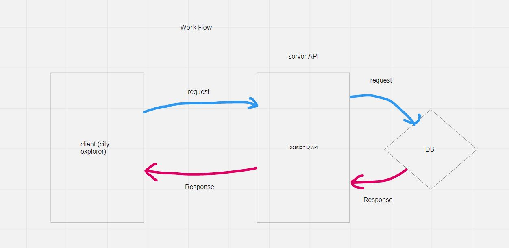
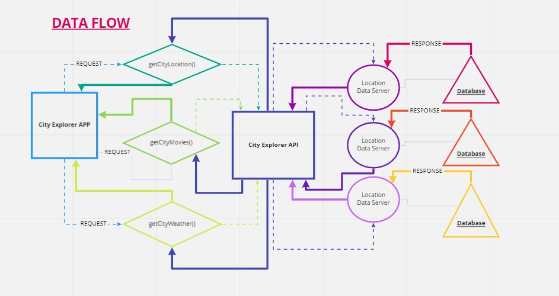
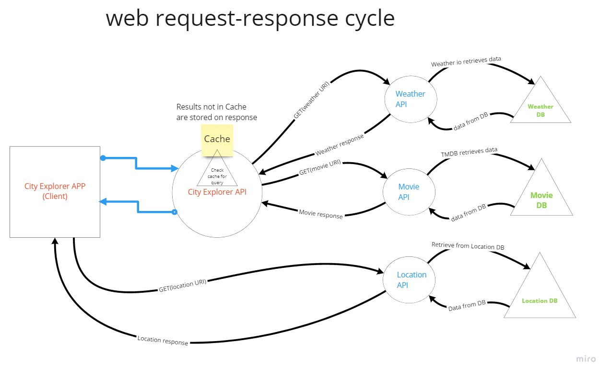

# Web request response cycle

Name of feature: lat long and static map

Estimate of time needed to complete: 2 hrs

Start time: 1600

Finish time: 1730

Actual time needed to complete: 1.5 hrs 

Name of feature: Weather functionality

Estimate of time needed to complete: 2 hrs

Start time: 1600

Finish time: 1800

Actual time needed to complete: 2 hrs 

Name of feature: Weather + movie functionality with server and cache

Estimate of time needed to complete: 2.5 hrs

Start time: 1600

Finish time: 1830

Actual time needed to complete: 2.5 hrs

# Project Name

**Author**: Rushabh Soni
**Version**: 1.0.0 
## Overview
<!-- Provide a high level overview of what this application is and why you are building it, beyond the fact that it's an assignment for this class. (i.e. What's your problem domain?) -->

## Getting Started
<!-- What are the steps that a user must take in order to build this app on their own machine and get it running? -->

## Architecture
<!-- Provide a detailed description of the application design. What technologies (languages, libraries, etc) you're using, and any other relevant design information. -->

## Change Log
<!-- Use this area to document the iterative changes made to your application as each feature is successfully implemented. Use time stamps. Here's an example:

01-01-2001 4:59pm - Application now has a fully-functional express server, with a GET route for the location resource. -->

## Credit and Collaborations
Web request response cycle layout collaborated with Joey H.